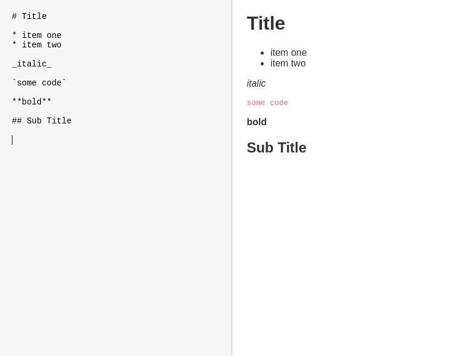
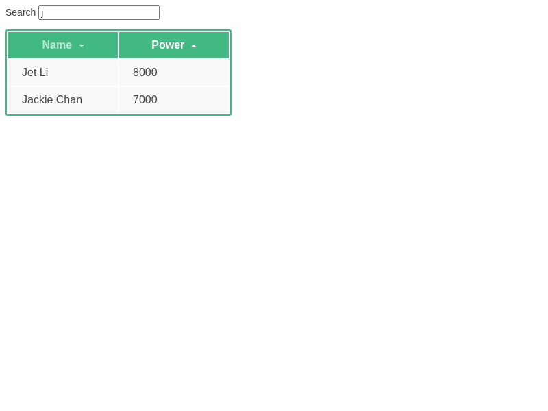
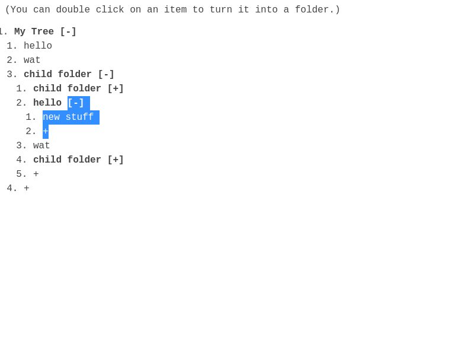
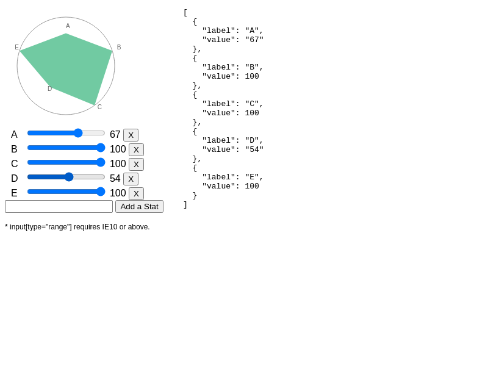
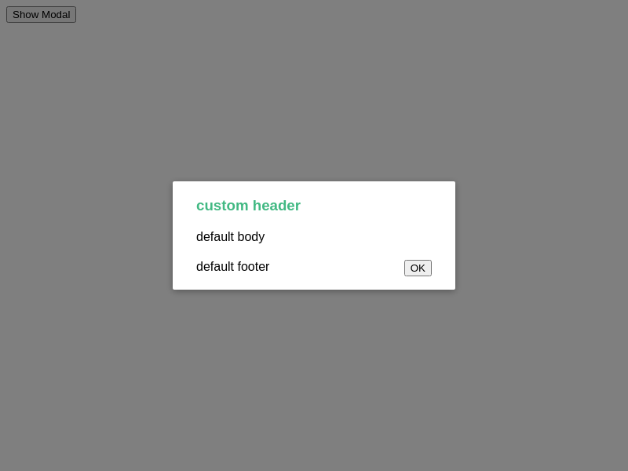
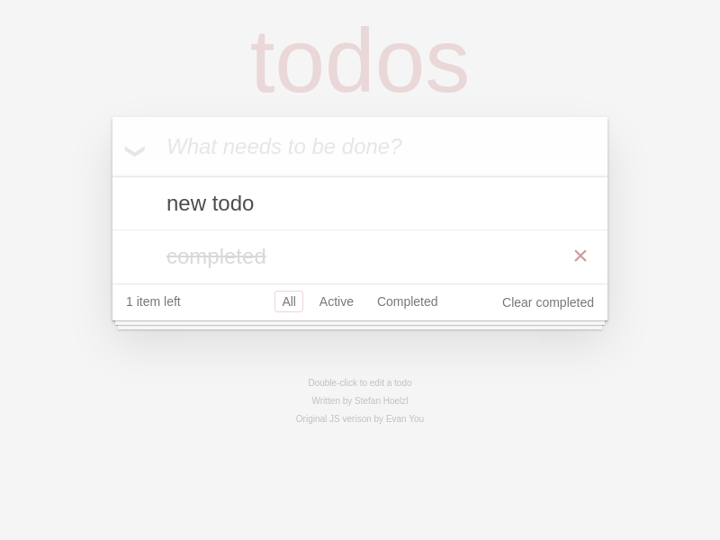

# Example Gallery

## Markdown Editor
[Demo](https://stefanhoelzl.github.io/vue.py/examples/markdown_editor)

[Source](https://github.com/stefanhoelzl/vue.py/tree/master/examples/markdown_editor)



## GitHub Commits
[Demo](https://stefanhoelzl.github.io/vue.py/examples/github_commits)

[Source](https://github.com/stefanhoelzl/vue.py/tree/master/examples/github_commits)


## Grid Component
[Demo](https://stefanhoelzl.github.io/vue.py/examples/grid_component)

[Source](https://github.com/stefanhoelzl/vue.py/tree/master/examples/grid_component)



## Tree View
[Demo](https://stefanhoelzl.github.io/vue.py/examples/tree_view)

[Source](https://github.com/stefanhoelzl/vue.py/tree/master/examples/tree_view)



## SVG Graph
[Demo](https://stefanhoelzl.github.io/vue.py/examples/svg_graph)

[Source](https://github.com/stefanhoelzl/vue.py/tree/master/examples/svg_graph)



## Modal Component
[Demo](https://stefanhoelzl.github.io/vue.py/examples/modal_component)

[Source](https://github.com/stefanhoelzl/vue.py/tree/master/examples/modal_component)



## TodoMVC
[Demo](https://stefanhoelzl.github.io/vue.py/examples/todo_mvc)

[Source](https://github.com/stefanhoelzl/vue.py/tree/master/examples/todo_mvc)



## Run Examples Local

```bash
$ git clone https://github.com/stefanhoelzl/vue.py.git
$ cd vue.py
$ make env.up
$ make serve
```
Goto [http://localhost:8000/examples] and select the example

