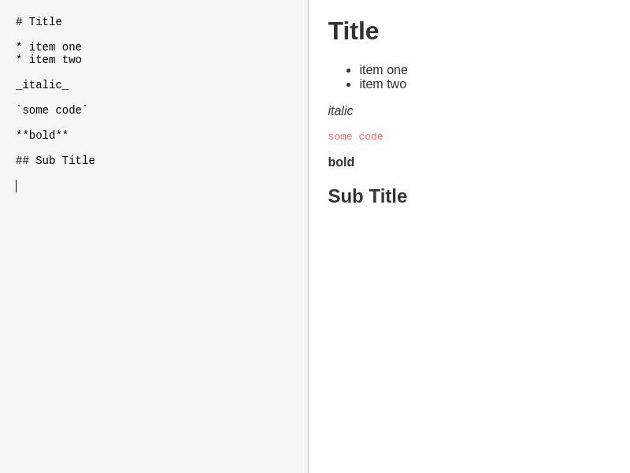
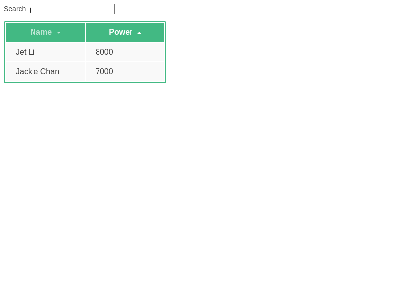
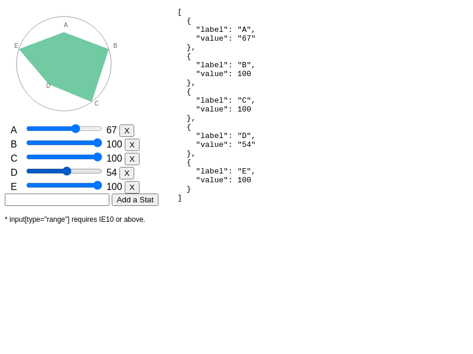
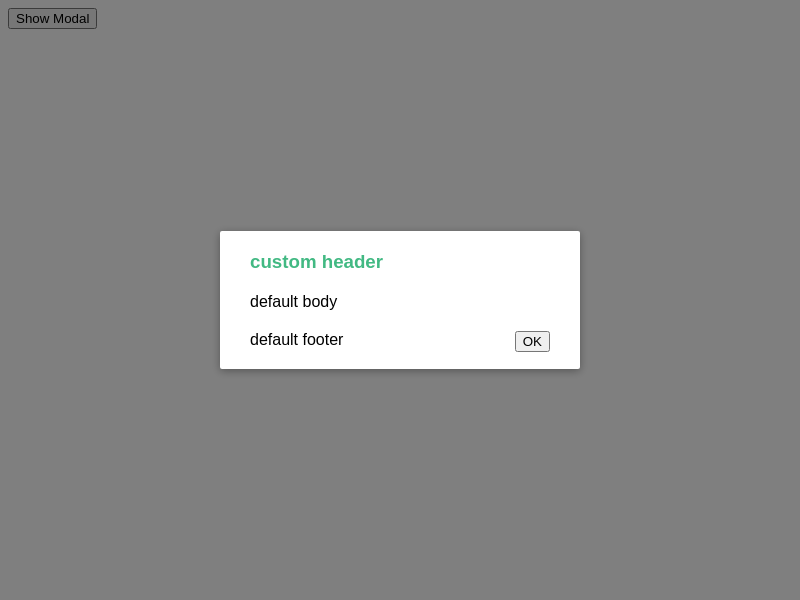

# Example Gallery

<iframe src="markdown_editor"></iframe>

## Markdown Editor


## GitHub Commits


## Grid Component


## Tree View


## SVG Graph


## Modal Component


## TodoMVC


## Run Examples Local

```bash
$ git clone https://github.com/stefanhoelzl/vue.py.git
$ cd vue.py
$ make env.up
$ make serve
```
Goto [http://localhost:8000/examples] and select the example

